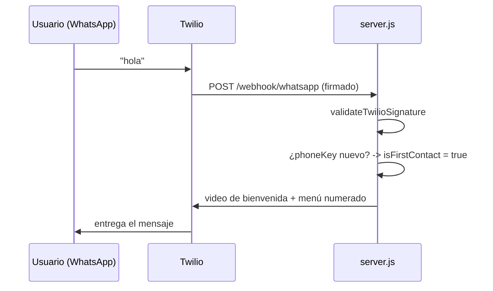

# Blueprint — Lucy, asistente virtual de C.A. de Seguros La Occidental

**Versión de esta entrega:** rama `release/cierre-entrega-final`, sobre `master`.
**Fecha:** septiembre de 2026.

Este documento resume la arquitectura completa del sistema: componentes, flujos de datos,
integraciones externas y decisiones de diseño. Es el punto de partida para cualquier persona
nueva que necesite entender "cómo está armado esto" antes de tocar código.

---

## 1. Visión general

Lucy es un **chatbot conversacional para una aseguradora venezolana**, con tres superficies:

1. **Widget de chat web** (`public/chatbot.js` + `chatbot.css`) — embebible en cualquier sitio
   con dos líneas de `<script>`, se comunica con el backend por HTTP + Server-Sent Events (SSE).
2. **WhatsApp Business** (vía Twilio) — mismo backend, mismo "cerebro" (Claude + los mismos
   flujos guionados), atendido por un webhook.
3. **Panel de administración** (`/admin`) y **portal de corredores** (`/corredor`) — interfaces
   web separadas para el personal interno y para los corredores/intermediarios.

Todo corre sobre **un único proceso Node.js/Express** (`server.js`, ~6.000 líneas) — no hay
microservicios ni colas de mensajes. La persistencia es **archivos JSON en disco** (sin base de
datos relacional), con un patrón de caché en memoria + escritura serializada en cada uno.

```
                    ┌──────────────────────────────────────────────┐
                    │              server.js (Express)              │
                    │                                                │
  Cliente web  ───► │  /api/chat (SSE)   ─┐                          │
  (chatbot.js)       │                     │                          │
                    │  /api/quote          ├──► Motor de intención/   │
  WhatsApp     ───► │  /webhook/whatsapp  ─┤    emoción + gates       │──► Claude (Anthropic API)
  (Twilio)           │                     │    deterministas         │
                    │  /api/admin/*       ─┤    (identificación,      │
  Admin (staff) ──► │  /api/corredor/*    ─┘    siniestro, rating,    │──► OpenAI (voz→texto, TTS fallback)
  (/admin)           │                          OTP, cotizador...)    │
                    │                                                │──► ElevenLabs (TTS preferido)
  Corredores    ──► │  Servicios: polizas / siniestros / corredores  │
  (/corredor)        │  Scheduler: recordatorios, seguimientos,       │──► Twilio (envío WhatsApp)
                    │              valoración por inactividad         │
                    └──────────────────────────────────────────────┘
                                        │
                                        ▼
                    conversations.json · data/clientes.json · data/polizas.json
                    data/siniestros.json · data/corredores.json · data/emisiones.json
                    data/gaps-conocimiento.json · data/notificaciones-programadas.json
                    quoter-config.json · uploads/ (fotos, PDFs, audio, video-cache)
```

---

## 2. Principio de diseño central: "determinista primero, Claude después"

Repetido en todo el código y en cada decisión de esta entrega: **cualquier paso que necesite
un resultado exacto, repetible o auditable se resuelve con código determinista (regex, máquinas
de estado, keywords) — nunca dejando que el modelo "decida" o formatee JSON estructurado.**
Claude se usa para lo que hace mejor: conversar, explicar, adaptarse al tono del usuario.

Ejemplos de flujos deterministas (siempre corren **antes** de invocar a Claude, y si "manejan"
el turno, Claude ni se llama):

- Identificación del cliente por cédula/póliza + verificación por OTP.
- Apertura y seguimiento de siniestros (PASO 1-5 guionados).
- El cotizador automático (RCV, HCM, Patrimoniales) — tarifas de `quoter-config.json`.
- El menú de bienvenida por WhatsApp.
- La pregunta de valoración (1-5 estrellas) y su interpretación.
- El envío de videos/imágenes del catálogo cuando el texto del usuario coincide con un trigger.

Lo único "con IA" además de la respuesta conversacional es un **clasificador rápido de
intención/emoción** (modelo económico, `CLAUDE_FAST_MODEL`) que se usa solo para *matizar* el
tono de la respuesta y disparar la pregunta de valoración — nunca para tomar decisiones de
negocio.

---

## 3. Componentes del backend (`server.js`)

| Bloque | Responsabilidad |
|---|---|
| Config e inicialización | Carga `.env`, valida claves requeridas, instancia clientes (Anthropic, Twilio, OpenAI, ElevenLabs, nodemailer), crea directorios de `uploads/`. |
| `SYSTEM_PROMPT` / `WHATSAPP_SYSTEM_ADDENDUM` | El prompt de sistema de Claude — identidad de Lucy, ramos, conocimiento institucional (historia, misión, sucursales, Defensor del Asegurado, métodos de pago), reglas de negocio ("nunca inventes precios"). |
| Persistencia de conversaciones | `conversationsCache` (memoria) + `conversations.json` (disco), con cola de escritura serializada (`writeQueue`) para evitar condiciones de carrera. |
| Memoria persistente de clientes | `data/clientes.json` — perfil por cédula, independiente de cualquier conversación puntual. |
| **Identificación + OTP** | Gate determinista: pide cédula/póliza, y si el canal no es de confianza (no es el WhatsApp ya registrado del cliente), exige un código de 6 dígitos por correo antes de mostrar datos reales. |
| **`services/polizas.service.js`** | Consulta de pólizas por cédula (lee `data/polizas.json`, o una API REST externa si se configura `POLIZAS_API_URL`). |
| **`services/siniestros.service.js`** | CRUD de siniestros (`data/siniestros.json` o `SINIESTROS_API_URL`) — abrir, consultar, actualizar documentos, asignar ajustador. |
| **Flujo de siniestros** | Máquina de estados guionada (heridos → identificación → tipo/fecha/descripción/ubicación → documentos → confirmación), con escalado automático a "siniestro mayor" si el monto reclamado supera USD 3.000. |
| **Cotizador automático** | RCV, HCM y Patrimoniales — arma un formulario interactivo (web) o conversacional (WhatsApp) y calcula el estimado con las tarifas de `quoter-config.json`, sin involucrar a Claude en el cálculo. |
| **Motor de inteligencia** | `classifyIntentAndEmotion` (clasificador rápido), `isSatisfactionSignal` + `RATING_ASK_TEXT` (valoración 1-5 ⭐), `registrarGapConocimiento` (preguntas que Lucy no supo responder bien). |
| **`config/scheduler.config.js`** + tareas `node-cron` | Recordatorios de pólizas por vencer (9am, cooldown de 7 días), seguimiento de cotizaciones sin respuesta (3pm, 48h), pregunta de valoración por inactividad (cada 2 min, umbral 10 min). |
| **`services/corredores.service.js`** | Autenticación JWT + bcrypt, cálculo de comisiones, cotizador profesional con PDF, emisión de pólizas (flujo de aprobación admin), notificaciones SSE en tiempo real. |
| **Catálogo de video/imagen** | `VIDEO_CATALOG` / `MEDIA_CATALOG` — videos de bienvenida/despedida y explicativos, imágenes/infografías, con triggers por palabra clave o uso explícito (saludo, despedida). |
| **Adjuntos** | Subida de fotos/PDF (`multer`), transcripción de notas de voz (OpenAI Whisper), respuestas en audio (ElevenLabs o OpenAI TTS como respaldo). |
| **Panel `/admin`** | Sesión por cookie, ve conversaciones en vivo (SSE), modo supervisor (tomar control, mensajes en la sombra), base de datos de clientes/pólizas/siniestros, exportación CSV. |
| **Portal `/corredor`** | Sesión JWT, cartera de clientes, pólizas por vencer, siniestros de cartera, comisiones, cotizador profesional, solicitudes de emisión, documentos descargables. |

---

## 4. Integraciones externas

| Servicio | Para qué se usa | Configuración |
|---|---|---|
| **Anthropic (Claude)** | Motor conversacional principal (`claude-opus-5`) y clasificador rápido (`claude-haiku-4-5-20251001`). | `ANTHROPIC_API_KEY`, `CLAUDE_MODEL`, `CLAUDE_FAST_MODEL` |
| **Twilio** | Envío/recepción de mensajes de WhatsApp Business (texto, imágenes, videos, audio). | `TWILIO_ACCOUNT_SID`, `TWILIO_AUTH_TOKEN`, `TWILIO_WHATSAPP_NUMBER` |
| **OpenAI** | Transcripción de notas de voz (Whisper) y texto-a-voz de respaldo (`tts-1`, voz "nova"). | `OPENAI_API_KEY` |
| **ElevenLabs** | Texto-a-voz preferido (voz más natural) — si no está configurado, cae a OpenAI TTS. | `ELEVENLABS_API_KEY`, `ELEVENLABS_VOICE_ID` |
| **SMTP (nodemailer)** | Envío de códigos OTP de verificación de identidad por correo. Sin configurar, el código solo se imprime en el log del servidor (modo desarrollo). | `SMTP_HOST`, `SMTP_PORT`, `SMTP_SECURE`, `SMTP_USER`, `SMTP_PASS`, `SMTP_FROM` |

Todas estas integraciones son **opcionales de forma independiente**: si falta una clave, esa
funcionalidad puntual se desactiva con un aviso en el log (por ejemplo, sin `TWILIO_*` no hay
WhatsApp, pero el widget web sigue funcionando; sin `OPENAI_API_KEY`/`ELEVENLABS_*` no hay
audio, pero el texto sigue funcionando).

---

## 5. Persistencia — "las tablas" del sistema

No hay motor de base de datos: cada "tabla" es un archivo JSON, cargado en memoria al arrancar
el servidor y reescrito por completo en cada cambio (con una cola de escritura para evitar
condiciones de carrera entre peticiones concurrentes). El detalle campo por campo de cada
archivo está en **[DICCIONARIO_DATOS.md](DICCIONARIO_DATOS.md)**.

| Archivo | Contenido | ¿Se versiona en git? |
|---|---|---|
| `conversations.json` | Historial completo de conversaciones (web + WhatsApp), por sesión/teléfono. | No — datos reales de clientes |
| `data/clientes.json` | Memoria persistente de clientes por cédula. | No — datos reales de clientes |
| `data/polizas.json` | Pólizas — fixture de ejemplo (o proxy a una API real vía `POLIZAS_API_URL`). | Sí — datos de ejemplo |
| `data/siniestros.json` | Siniestros — fixture de ejemplo (o proxy a una API real). | Sí — datos de ejemplo |
| `data/corredores.json` | Cuentas de corredores (demo). | Sí — credenciales de demo documentadas |
| `data/emisiones.json` | Solicitudes de emisión de póliza enviadas desde el portal de corredores. | No — datos reales de clientes |
| `data/gaps-conocimiento.json` | Preguntas que Lucy no respondió bien (motor de inteligencia). | No |
| `data/notificaciones-programadas.json` | Registro de qué recordatorios ya se enviaron (evita spam). | No |
| `quoter-config.json` | Tarifas y configuración del cotizador automático — editable desde `/admin`. | Sí |
| `uploads/` | Fotos, PDFs, notas de voz, audio de respuestas, caché de video comprimido para WhatsApp. | No |

---

## 6. Flujos clave (diagramas)

### 6.1 Primer contacto por WhatsApp



### 6.2 Identificación + verificación OTP

```mermaid
flowchart TD
    A[Usuario da cédula o póliza] --> B{¿Cliente encontrado?}
    B -- no --> C[Reintenta / puede decir "prefiero no decir"]
    B -- sí --> D{¿Canal confiable?<br/>WhatsApp = teléfono ya registrado}
    D -- sí --> E[Identificación completa,<br/>sin pedir OTP]
    D -- no --> F[Pide/confirma correo]
    F --> G[Genera código de 6 dígitos<br/>lo envía por correo]
    G --> H{¿Código correcto?}
    H -- sí, dentro de 10 min --> E
    H -- no, 3 intentos --> C
```

### 6.3 Apertura de un siniestro

```mermaid
flowchart LR
    A[PASO 1<br/>¿Hay heridos?] --> B[PASO 2<br/>Identificación<br/>+ OTP si aplica]
    B --> C[PASO 3<br/>Tipo / fecha /<br/>descripción / ubicación]
    C --> D[PASO 4<br/>Recepción de<br/>documentos]
    D --> E[PASO 5<br/>Confirmación<br/>+ número de siniestro]
    E --> F{¿Monto reclamado<br/>&gt; USD 3.000?}
    F -- sí --> G[Escalado a<br/>"siniestro mayor"]
    F -- no --> H[Flujo normal]
```

---

## 7. Seguridad — resumen (detalle completo en `MANUAL_INFRAESTRUCTURA.md`)

- Firma de webhooks de Twilio validada por HMAC-SHA1.
- Verificación de identidad por OTP antes de exponer datos reales de un cliente (ver §6.2).
- Comparación de contraseñas con `bcrypt` (corredores) y timing-safe compare (admin, dummy-hash
  para no filtrar por temporización si la cuenta no existe).
- Rate limiting por IP en endpoints públicos.
- Sesiones de `/admin` por cookie httpOnly; sesiones de `/corredor` por JWT.
- CORS restringido a `ALLOWED_ORIGINS`.
- Nunca se piden ni procesan números de tarjeta/contraseñas por el chat (regla explícita del
  `SYSTEM_PROMPT`).

---

## 8. Qué NO tiene este sistema (alcance explícito)

Para evitar expectativas equivocadas en el traspaso:

- **No hay base de datos relacional** — es un sistema de archivos JSON, pensado para el volumen
  actual. Migrar a Postgres/MySQL es el paso natural si el tráfico crece (ver
  `MANUAL_INFRAESTRUCTURA.md`, sección "Crecimiento futuro").
- **No hay emisión ni cobro real de pólizas** — el cotizador da un estimado; la emisión formal
  la procesa un asesor humano (o, en el portal de corredores, queda como una solicitud pendiente
  de aprobación administrativa, sin integrarse a un sistema de core de pólizas real).
- **No hay integración con sistemas legacy** (AS400, SAP, etc.) — las "pólizas" y "siniestros"
  viven en los JSON de este proyecto, o en una API REST externa si se configura.
- **No hay app móvil nativa** — solo el widget web embebible y WhatsApp.
- **No hay panel multi-tenant** — está pensado para una sola compañía (La Occidental).
